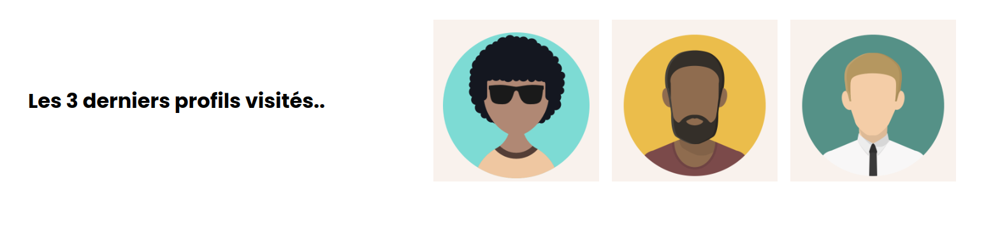

## 

# 
3 last profils

---

### Table of Contents

The sections headers will be used to reference location of destination.

- [Description](#description)
- [How To Use](#how-to-use)
- [References](#references)
- [Author Info](#author-info)

---

## Description

I created 3 card profiles to serve as a prototype for a wordpress plugin

#### Technologies

- HTML
- CSS

---

## How To Use

You can check the demo here: https://3lastprofils.netlify.app/

## References

inspiration: 

- https://www.w3schools.com/howto/howto_css_profile_card.asp
- https://dribbble.com/tags/profile_card
- https://freefrontend.com/css-profile-cards/

---

## Author Info

- Twitter - [@diagodryson](https://twitter.com/diagodryson)
- Linkedin - [@diagodryson](https://linkedin.com/in/diagodryson)

[Back To The Top](#read-me-template)
